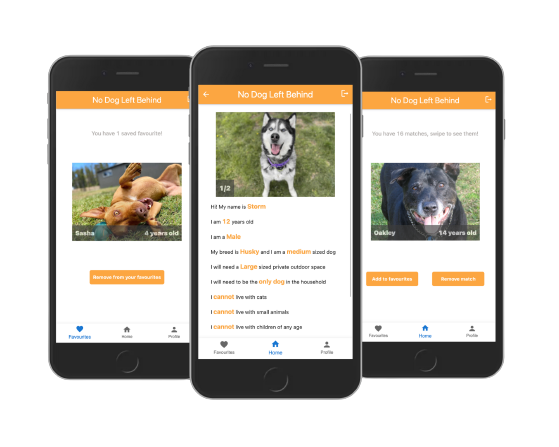

# No Dog Left Behind

No Dog Left Behind is a web app that aims to provide a centralised dog adoption platform. Instead of spending hours scrolling through countless listings for dogs that potential adopters don't meet the adoption criteria for across multiple adoption platforms, adopters are only shown dogs that they meet all the adoption criteria for all in one place!

## Screenshots

<p align="center">
  

</p>

## Getting started

In order to work on the No Dog Left Behind web app you will need npm and Node.

## Installation

1. Clone this repo and enter!

   ```bash
   git clone https://github.com/KristenHickey/No-Dog-left-Behind
   ```

2. Install dependencies.

   ```bash
   cd server
   npm i
   cd ..
   cd client
   npm i
   ```

3. Create a .env in the client folder with the following variable:

   - REACT_APP_SERVERURL

4. Create a .env in the server folder with the following variables:

   - DATABASE_URI
   - SERVER_PORT

5. From the termial, in the client folder, run `npm start`, this runs the app in the development mode. Open http://localhost:3000 to view it in the browser. The page will reload if you make edits, you will also see any lint errors in the console.

   ```bash
   cd client
   npm start
   ```

6. From a seperate terminal, in the server folder, run `node index` to start the server.
   ```bash
    cd server
    node index
   ```

## Tech Stack

### Front End

- [React](https://reactjs.org/)
- [TypeScript](https://www.typescriptlang.org/)
- [Less](https://lesscss.org/)

### Back End

- [Express](https://expressjs.com/)
- [Node.js](https://nodejs.org/en/)
- [MongoDB](https://www.mongodb.com/)
- [Mongoose](https://mongoosejs.com/)

## Contributing

Any and all improvements are welcome, just fork the repo and submit a PR to show us what you've got!

## Contributors ✨

Thanks goes to these wonderful people ([emoji key](https://allcontributors.org/docs/en/emoji-key)):

<table>
  <tr>
     <td align="center" ><a href="https://github.com/hectorkd"><br /><sub><b><a href="https://www.linkedin.com/in/kristen-hickey-250605231/" title="linkedin">Kristen Hickey</a></b></sub></a><br /><a href="https://github.com/KristenHickey/No-Dog-left-Behind/commits/main" title="Code">💻</a> <a href="#ideas-hector" title="Ideas & Planning">🤔</a> <a href="#review-hector" title="Reviewed Pull Requests">👀</a> <a href="#design-hector" title="Design">🎨</a> <a href="#maintain-hector" title="Maintenance">🚧</a> <a href="https://www.youtube.com/watch?v=RKsBLbWr3cg" title="Videos">📹</a></td>
  <tr>
        <table>
